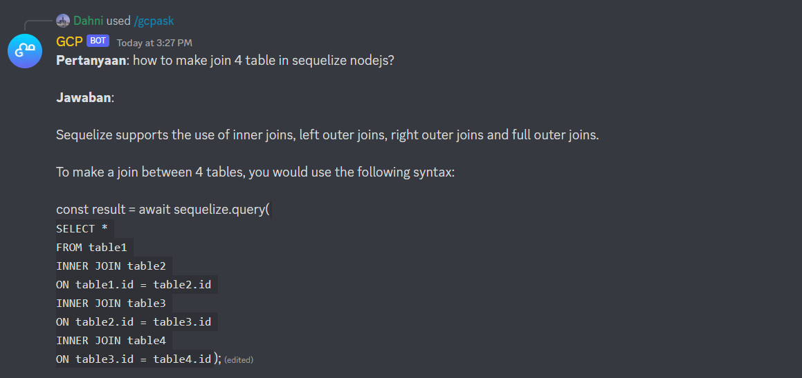
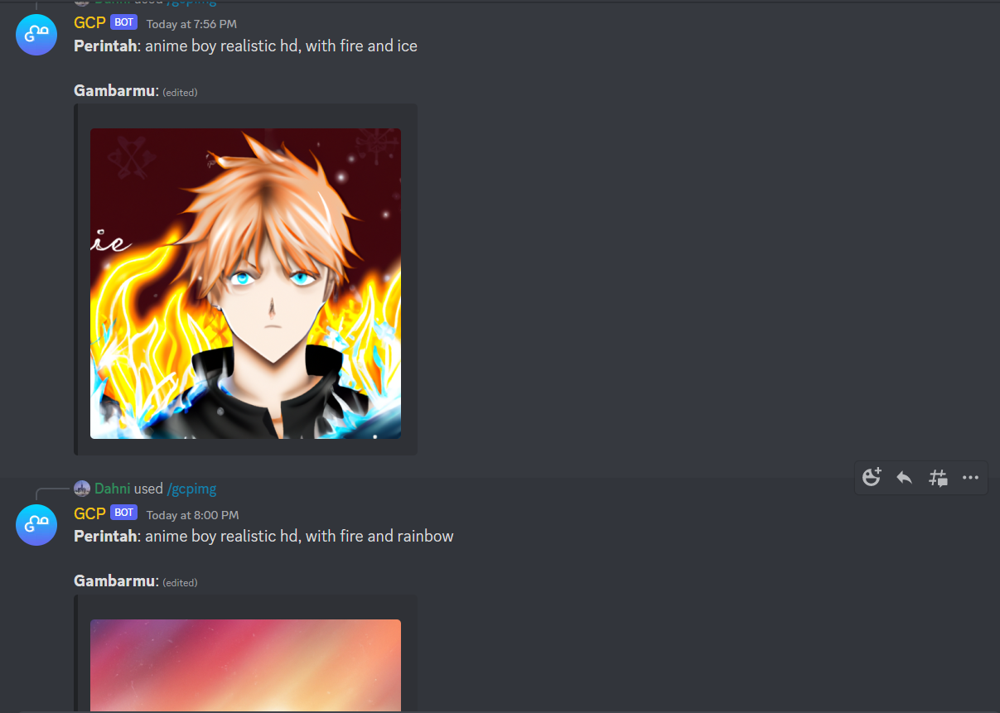

# GCP DISCORD BOT CHAT GPT

Demo, join here : https://discord.gg/Jsh9aaaTz4

### Configuration
Before configuring you must first register with `openai` to get an api key, if you already have an api key, do the steps below.

Rename file `env` to `.env`, and change this with your own api dan discord token
```
DISCORD_BOT_TOKEN=YOUR_DISCORD_TOKEN
DISCORD_CLIENT_ID=YOUR_APP_ID_DISCORD
OPENAI_API_KEY=YOUR_API_OPENAI
TEXT_LENGTH = 500
CMD_ASK = gcpask
CMD_IMG = gcpimg
```

- TEXT_LENGTH -> function to determine the word length of the ChatGPT results, you can change it with what you want
- CMD_ASK -> change it with your command for asking text
- CMD_IMG -> change it with your command for generate image

If you want regenerate dependencies, just run
```bash
npm install
```

### Output


